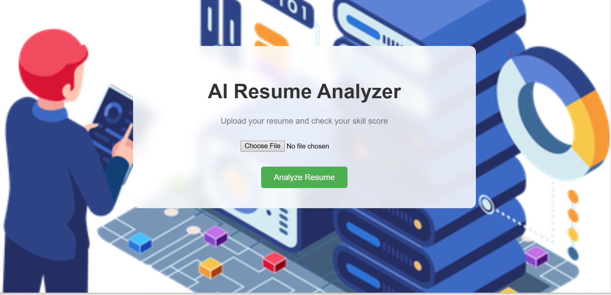

# AI Resume Analyzer

AI Resume Analyzer is a Flask-based web application that analyzes resumes and detects skills to generate a resume score.

***Live Demo:- https://rankcv.vercel.app

## Features
- Upload resume (PDF)
- Skill detection
- Resume score calculation
- Missing skill suggestions
- Clean UI dashboard

## Tech Stack
- Python
- Flask
- HTML
- CSS
- JavaScript
- Chart.js

## Installation

Clone the repository:

git clone https://github.com/yourusername/ai-resume-analyzer.git

Install dependencies:

pip install -r requirements.txt

Run the project:

python app.py

Open in browser:

http://127.0.0.1:5000
